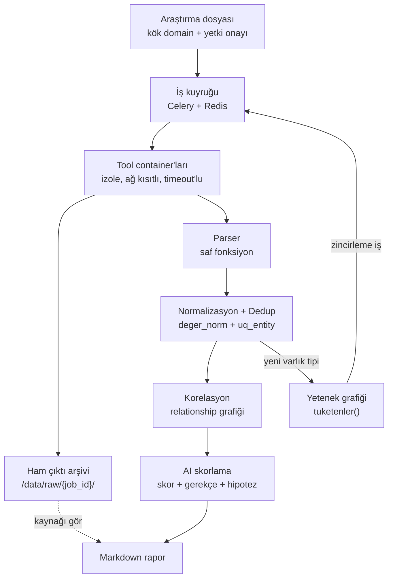

# OSINT Orkestrasyon Platformu

Ekip içi (kapalı) kullanım için pasif OSINT orkestrasyon aracı. Bir kök domain
verildiğinde pasif keşif araçlarını otomatik koşturur, çıktılarını tek bir veri
modelinde tekilleştirir, varlıklar arasındaki ilişkileri kurar ve bulguları bir
dil modeliyle önceliklendirir.

Değer toplama katmanında değil; **normalizasyon, korelasyon ve önceliklendirme**
katmanındadır. Amaç yeni bir tarama tekniği geliştirmek değildir — mevcut
araçların ürettiği dağınık çıktıyı analiste kullanılabilir hâle getirmektir.

---

## Neden var

Bir hedef hakkında araştırma yapmak bugün altı ayrı aracı ayrı ayrı çalıştırmak,
çıktılarını elle bir yere not etmek ve neyin önemli olduğuna gözle karar vermek
demek. Bu üç ayrı yerde bozuluyor:

- **Tekrar.** Aynı subdomain üç farklı araçtan çıkıyor, üç kez not ediliyor.
  Hangisinin hangi araçtan geldiği birkaç saat sonra hatırlanmıyor.
- **Kayıp.** Araç çıktıları terminalde kalıyor. "Bu IP'yi nereden bulmuştuk"
  sorusunun cevabı yok, dolayısıyla bulgu doğrulanamıyor.
- **Ölçek.** Otuz varlık gözle taranabilir; üç yüz varlıkta önemli olan
  gürültüde kayboluyor ve sıralama tamamen sezgiye kalıyor.

Bu sistem üçünü de veri modeli seviyesinde çözüyor: her varlık tek satır, her
gözlem ayrı kayıt, her kayıt ham çıktısına kadar izlenebilir, sıralama ise
gerekçesiyle birlikte üretilen bir skorla yapılıyor.

---

## Mimari



Zincirleme kuralı hiçbir yerde elle yazılmaz. Her tool manifest'inde hangi varlık
tiplerini kabul ettiğini ve hangilerini ürettiğini bildirir; registry bu iki
alandan bir yetenek grafiği kurar. `subfinder` bir SUBDOMAIN ürettiğinde,
SUBDOMAIN kabul eden tüm etkin tool'lar kendiliğinden kuyruğa girer.

**Yığın:** Python 3.12, FastAPI, PostgreSQL 16, Celery + Redis, Jinja2 + HTMX,
Gemini API, docker-compose.

---

## Tasarım kararları ve gerekçeleri

Bu bölüm projenin asıl içeriği. Kararların çoğu, ilk bakışta daha zahmetli
görünen seçeneği tercih ediyor; sebepleri aşağıda.

### AI veri silmez, sadece skorlar

Dil modeli hiçbir bulguyu elemez, gizlemez veya filtrelemez. Yalnızca 0-100
arası bir skor ve kısa bir gerekçe üretir; arayüz bu skora göre **sıralar**,
filtrelemez.

Gerekçe: yanlış pozitif görünürdür — analist listeye bakar, ilgisiz olduğunu
görür, geçer. Yanlış negatif görünmezdir. Model bir varlığı yanlışlıkla elerse
o varlık hiçbir zaman kimsenin önüne çıkmaz ve hatanın fark edilmesinin bir yolu
yoktur. Sıralamanın hatası bir dakikaya, filtrelemenin hatası bulunmamış bir
açığa mal olur. Bu yüzden filtreleme özelliği bilinçli olarak yoktur.

### Tool çıktısı güvenilmeyen veridir

Toplanan verinin bir kısmı doğrudan hedefin kontrolündedir: sayfa başlıkları,
sertifika alanları, DNS TXT kayıtları, banner metinleri. Bunlar modele girdi
olacaksa, hedef modele talimat yazabilir demektir.

Önlemler: ham çıktı modele hiçbir zaman doğrudan gitmez, önce ön elemeden
geçmiş kompakt bir listeye indirgenir. Bu liste `<untrusted_data>` sınırlayıcısı
içine alınır ve sistem prompt'unda bu blok içindeki talimatların uygulanmayacağı
açıkça belirtilir. Model yanıtı serbest metin değil, şemaya bağlı structured
output olarak alınır. Son olarak modelin döndürdüğü her `entity_id` veritabanında
doğrulanır; karşılığı olmayan kayıtlar atılır. Bu son adım halüsinasyon
filtresidir: model var olmayan bir varlık uydurursa rapora giremez.

### parse() saf fonksiyondur

Her tool adapter'ı ikiye ayrılır: `calistir()` aracı çalıştırıp ham çıktıyı
döndürür, `parse()` ham çıktıyı gözlemlere çevirir. `parse()` içinde ağ erişimi,
veritabanı erişimi, dosya okuma, saat okuma ve rastgelelik yasaktır.

Gerekçe: dış dünyaya bağımlı olmadığı için `parse()` tek başına, kaydedilmiş bir
fixture dosyasıyla test edilebilir. Bir aracın çıktı formatı sessizce
değiştiğinde test kırılır ve durum aynı gün fark edilir. Bu ayrım olmadan sistem
üretimde sessizce yanlış veri üretmeye başlar ve kimse bunu görmez — OSINT
araçlarında en tehlikeli hata sınıfı budur. **Fixture'sız tool kabul edilmez.**

Aynı kural `normalize()` için de geçerlidir; o da saf ve deterministiktir.

### Observation nesnesi entity_id taşımaz

Parser'ın ürettiği `Observation` veri sınıfında bilinçli olarak `entity_id`
alanı yoktur. Parser veritabanının varlığından habersizdir; ilişkileri bile
ID ile değil, değerlerle ifade eder (`ObservedRelation.hedef_deger`).

Gerekçe: ID çözümlemesi ingest katmanının işidir. Parser'a `entity_id`
verilseydi, parser'ın çalışabilmesi için önce veritabanına yazılmış olması
gerekirdi — yani saf fonksiyon olamazdı, fixture ile test edilemezdi ve yukarıdaki
maddenin tamamı çökerdi. Bu eksiklik projenin en önemli tasarım kararıdır ve
kodda yorumla korunmaktadır.

### Dedup, UNIQUE kısıtı ve ON CONFLICT ile çözülür

Aynı varlığı iki kaynaktan görmek istisna değil, normal durumdur.
Tekilleştirme `uq_entity (investigation_id, tip, deger_norm)` kısıtı ve
`INSERT ... ON CONFLICT DO UPDATE` ile yapılır. "Önce SELECT, yoksa INSERT"
deseni kullanılmaz.

Gerekçe: naif desen tek worker'da doğru görünür, paralel worker'larda bozuktur.
İki worker aynı anda SELECT çalıştırıp ikisi de "yok" cevabını alır, ikisi de
INSERT dener ve biri kısıta çarpar. Aradaki pencere ne kadar dar olursa olsun
kapanmaz. Bu iddia varsayım değil, ölçüm: aynı test koşullarında naif desen
10 paralel thread'in 9'unda `IntegrityError` verir ve gözlem sayacı 10 yerine
1'de kalır. `ON CONFLICT` çakışma kontrolünü yazma ile aynı ifadeye koyduğu için
yarış koşulu ortadan kalkar ve retry döngüsü gerekmez.

Aynı desen ilişkiler için `uq_rel` üzerinden tekrarlanır. `job` tablosundaki
`uq_job_tekrar (investigation_id, tool, hedef_deger)` kısıtı ise otomatik
zincirlemede kaçınılmaz olan A→B→A çevrimlerini veritabanı seviyesinde
imkânsız kılar; `derinlik` alanı da ikinci bir güvenlik sınırıdır.

### Normalizasyon yazma anında yapılır

`api.firma.com`, `API.Firma.com`, `https://api.firma.com/v1`, `api.firma.com.`
ve `api.firma.com:8080` aynı şeydir. Bunları eşleştiren `deger_norm` değeri
kayıt yazılırken hesaplanır ve saklanır; sorgu anında hesaplanmaz.

Gerekçe: dedup'ı sorgu anında çözmeye çalışmak mimari hatadır. Eşleştirme
anahtarı sütunda durmazsa UNIQUE kısıtı kurulamaz, kısıt kurulamazsa yukarıdaki
maddedeki yarış koşulu çözülemez. Ayrıca her sorgu normalizasyonu yeniden
çalıştırmak zorunda kalır ve indeks kullanılamaz.

Normalizasyonun kendisinde de birkaç bilinçli tercih var:

- **`www` asla atılmaz.** `www.firma.com` ayrı bir subdomain'dir ve farklı bir
  sunucuya çözülebilir; atmak veri kaybıdır.
- **Domain/subdomain kararı nokta sayarak verilmez**, Public Suffix List ile
  verilir. `firma.com.tr` iki nokta içerir ama kök domaindir; nokta saymak
  `.com.tr`, `.co.uk`, `.gov.tr` gibi son eklerde her zaman yanlış sonuç verir.
- **Punycode dönüşümü etiket bazında yapılır.** `_dmarc.firma.com` gibi alt
  çizgili etiketler IDNA'da hata verir; zaten ASCII olan etiketler olduğu gibi
  bırakılır.
- **Türkçe büyük İ özel olarak ele alınır.** Python'da `"İ".lower()` iki kod
  noktası üretir (`i` + birleşik aksan); eşleştirme anahtarında bu kabul
  edilemez, çünkü `İSTANBUL.firma.com` ile `istanbul.firma.com` farklı
  anahtarlara düşerdi.
- **IPv6 servis adreslerinde köşeli parantez zorunludur.** Parantezsiz
  `2001:db8::1:443` aynı anda "adres `2001:db8::1`, port 443" ve "adres
  `2001:db8::1:443`" olarak okunabilir; iki servis aynı anahtara çakışır ve
  ilişki yanlış IP kaydına bağlanır. Yanlış bağlanmış bir ilişki, kaybolmuş bir
  kayıttan daha zararlıdır: analiste doğru bir bulgu gibi görünür.

### v1 tamamen pasiftir

Her tool bir pasiflik seviyesiyle etiketlenir ve bu etiket `ToolSpec` içinde
bir alan olarak yaşar:

| Seviye | Tanım | v1 |
|--------|-------|-----|
| P0 | Hedefe hiç dokunulmaz, üçüncü taraf veri kaynağı sorgulanır | Açık |
| P1 | Genel/ortak altyapıya sorgu (public resolver) | Açık |
| P2 | Hedefin altyapısına normal kullanıcı trafiği düzeyinde | Varsayılan kapalı, yetki onayı ister |
| A | Aktif tarama | Kapsam dışı |

Yetki kontrolü **runner'da** yapılır, arayüzde değil. Gerekçe: arayüz kontrolü
atlanabilir — API doğrudan çağrılabilir, bir iş kuyruğa elle eklenebilir.
Kontrolün, işi gerçekten başlatan tek noktada olması gerekir.

### Diğer kararlar

- **Üç katman karıştırılmaz.** `entity` ne olduğunu, `observation` kimin ne
  zaman gördüğünü, `assessment` ne kadar önemli olduğunu tutar. Aynı IP'yi üç
  tool bulduysa: bir entity, üç observation. Bu ayrım olmadan "kaynağı gör"
  özelliği kurulamaz.
- **Assessment kayıtları güncellenmez, yalnızca eklenir.** Prompt değiştiğinde
  eski skorlar durur; "eski model neden böyle demişti" sorusu cevaplanabilir kalır.
- **Veritabanında native enum kullanılmaz**, `TEXT + CHECK` kullanılır. Native
  enum'a değer eklemek migration gerektirir ve tool eklendikçe bu sık olacaktır.
- **Tool eklemek çekirdek koda dokunmadan yapılır:** bir manifest, bir adapter,
  bir fixture. Hafta 3'ün çıktısı "üç tool eklendi" değil, "tool eklemek
  ucuzladı"dır.

---

## Mevcut durum

**Hafta 1 tamamlandı** — temel katman ayakta:

| Bileşen | Durum |
|---------|-------|
| Veri modeli, 7 tablo (SQLAlchemy 2.x) | Hazır |
| Normalizasyon, 10 varlık tipi | Hazır |
| Tool sözleşmesi ve registry | Hazır |
| Alembic migration (upgrade/downgrade doğrulandı) | Hazır |
| `upsert_entity` / `upsert_relationship` | Hazır |
| Test sayısı | 355 |

Testlerin 343'ü normalizasyon kurallarını kapsıyor; 12'si gerçek PostgreSQL'e
karşı koşan ingest testleri ve bunların ikisi eşzamanlılık testi (10 paralel
thread, ayrı bağlantılar, barrier ile senkronize).

**Sırada:** Hafta 2 — dikey dilim. Arayüzden bir domain girildiğinde ilk tool'un
container'da koşması, sonucun entity olarak veritabanına düşmesi ve ekranda
listelenmesi. Dikey dilim çalıştığı an mimarinin tamamı (API, kuyruk, worker,
runner, kalıcılık, arayüz) ayakta demektir. Yatay geliştirme bilinçli olarak
ertelenmiştir.

---

## Kurulum

Windows / PowerShell. `pip` ve `alembic` PATH'te olmayabilir; her zaman
`python -m ...` biçimi kullanılır.

**1. Servisleri başlat**

```powershell
docker compose up -d db redis
```

**2. Yapılandırmayı hazırla**

```powershell
Copy-Item .env.example .env
```

`.env` içindeki `POSTGRES_PASSWORD` ve `DATABASE_URL` parolasını değiştirin.
`.env` commit edilmez.

> **Windows'ta önemli:** `ALEMBIC_DATABASE_URL` içinde `localhost` değil,
> `127.0.0.1` yazın. `localhost` önce `::1`'e (IPv6) çözülür, docker-compose ise
> portları yalnızca IPv4 `127.0.0.1`'e yayınlar. Sonuç: her bağlantı önce IPv6'da
> TCP zaman aşımını bekler (100 saniyeden fazla) ve her şey donmuş gibi görünür.
> Doğru yazımda aynı bağlantı 10 milisaniyenin altındadır.

Neden iki ayrı URL: `DATABASE_URL` container ağı içindeki adı (`db`) kullanır ve
api/worker servisleri onu okur. `ALEMBIC_DATABASE_URL` ise host'tan çalışan
alembic ve pytest içindir. Aynı veritabanının nerede durduğunuza göre iki farklı
adı vardır.

**3. Bağımlılıklar ve şema**

```powershell
python -m pip install -r requirements.txt
```

```powershell
python -m alembic upgrade head
```

**4. Testler**

```powershell
python -m pytest tests/ -v
```

Veritabanı ayakta değilse ingest testleri atlanır, normalizasyon testleri koşar.

---

## Sorumlu kullanım

Bu araç yalnızca **araştırma yetkisine sahip olduğunuz hedeflerde** kullanılır.
Yetki bilgisi araştırma kaydında saklanır (`yetki_onayi`, `yetki_notu`).

v1 pasif OSINT yapar: üçüncü taraf veri kaynakları ve ortak altyapı sorgulanır.
Aktif tarama — port taraması, dizin taraması, brute-force, AXFR denemesi —
kapsam dışıdır ve eklenmeyecektir. Hedefin altyapısına doğrudan giden modüller
(P2) varsayılan olarak kapalıdır ve açık yetki onayı olmadan çalışmaz.

Sistem kapalı çalıştırılır: portlar `127.0.0.1`'e bağlanır, erişim VPN veya
Tailscale arkasındandır. **Halka açık instance yayınlanmaz.** Yetkisiz kullanımda
sunucunun IP adresi hedefin loglarına düşer ve sistemi çalıştıran taraf altyapı
sağlayıcı konumuna geçer.

Depoda hiçbir API anahtarı veya gerçek hedef/müşteri verisi bulunmaz — ekran
görüntüleri ve commit mesajları dahil.

> AI skorları önceliklendirme amaçlıdır. Doğrulama sorumluluğu analiste aittir.

---

## Lisans

<!-- LISANS DOSYASI EKLENECEK -->

Lisans metni için depo kökündeki `LICENSE` dosyasına bakınız.
