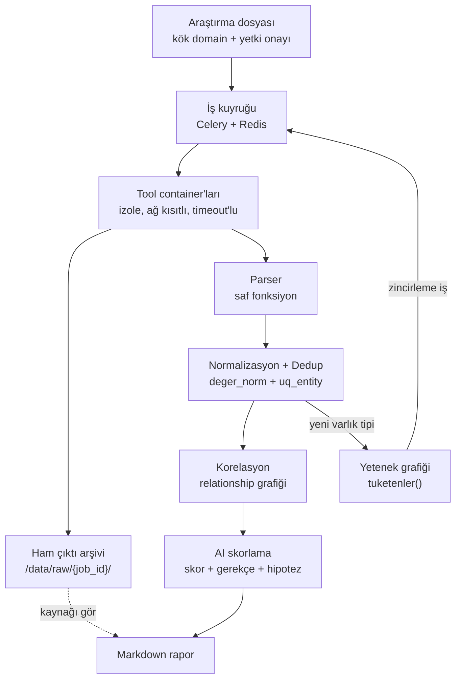

# OSINT Orkestrasyon Platformu

Ekip içi (kapalı) kullanım için pasif OSINT orkestrasyon aracı. Bir kök domain
verildiğinde pasif keşif araçlarını otomatik koşturur, çıktılarını tek bir veri
modelinde tekilleştirir, varlıklar arasındaki ilişkileri kurar ve bulguları bir
dil modeliyle önceliklendirir.

Değer toplama katmanında değil; **normalizasyon, korelasyon ve önceliklendirme**
katmanındadır. Amaç yeni bir tarama tekniği geliştirmek değildir — mevcut
araçların ürettiği dağınık çıktıyı analiste kullanılabilir hâle getirmektir.

---

## Neden var

Bir hedef hakkında araştırma yapmak bugün altı ayrı aracı ayrı ayrı çalıştırmak,
çıktılarını elle bir yere not etmek ve neyin önemli olduğuna gözle karar vermek
demek. Bu üç ayrı yerde bozuluyor:

- **Tekrar.** Aynı subdomain üç farklı araçtan çıkıyor, üç kez not ediliyor.
  Hangisinin hangi araçtan geldiği birkaç saat sonra hatırlanmıyor.
- **Kayıp.** Araç çıktıları terminalde kalıyor. "Bu IP'yi nereden bulmuştuk"
  sorusunun cevabı yok, dolayısıyla bulgu doğrulanamıyor.
- **Ölçek.** Otuz varlık gözle taranabilir; üç yüz varlıkta önemli olan
  gürültüde kayboluyor ve sıralama tamamen sezgiye kalıyor.

Bu sistem üçünü de veri modeli seviyesinde çözüyor: her varlık tek satır, her
gözlem ayrı kayıt, her kayıt ham çıktısına kadar izlenebilir, sıralama ise
gerekçesiyle birlikte üretilen bir skorla yapılıyor.

---

## Mimari



Zincirleme kuralı hiçbir yerde elle yazılmaz. Her tool manifest'inde hangi varlık
tiplerini kabul ettiğini ve hangilerini ürettiğini bildirir; registry bu iki
alandan bir yetenek grafiği kurar. `subfinder` bir SUBDOMAIN ürettiğinde,
SUBDOMAIN kabul eden tüm etkin tool'lar kendiliğinden kuyruğa girer.

**Yığın:** Python 3.12, FastAPI, PostgreSQL 16, Celery + Redis, Jinja2 + HTMX,
Gemini API, docker-compose.

---

## Tasarım kararları ve gerekçeleri

Bu bölüm projenin asıl içeriği. Kararların çoğu, ilk bakışta daha zahmetli
görünen seçeneği tercih ediyor; sebepleri aşağıda.

### AI veri silmez, sadece skorlar

Dil modeli hiçbir bulguyu elemez, gizlemez veya filtrelemez. Yalnızca 0-100
arası bir skor ve kısa bir gerekçe üretir; arayüz bu skora göre **sıralar**,
filtrelemez.

Gerekçe: yanlış pozitif görünürdür — analist listeye bakar, ilgisiz olduğunu
görür, geçer. Yanlış negatif görünmezdir. Model bir varlığı yanlışlıkla elerse
o varlık hiçbir zaman kimsenin önüne çıkmaz ve hatanın fark edilmesinin bir yolu
yoktur. Sıralamanın hatası bir dakikaya, filtrelemenin hatası bulunmamış bir
açığa mal olur. Bu yüzden filtreleme özelliği bilinçli olarak yoktur.

### Tool çıktısı güvenilmeyen veridir

Toplanan verinin bir kısmı doğrudan hedefin kontrolündedir: sayfa başlıkları,
sertifika alanları, DNS TXT kayıtları, banner metinleri. Bunlar modele girdi
olacaksa, hedef modele talimat yazabilir demektir.

Önlemler: ham çıktı modele hiçbir zaman doğrudan gitmez, önce ön elemeden
geçmiş kompakt bir listeye indirgenir. Bu liste `<untrusted_data>` sınırlayıcısı
içine alınır ve sistem prompt'unda bu blok içindeki talimatların uygulanmayacağı
açıkça belirtilir. Model yanıtı serbest metin değil, şemaya bağlı structured
output olarak alınır. Son olarak modelin döndürdüğü her `entity_id` veritabanında
doğrulanır; karşılığı olmayan kayıtlar atılır. Bu son adım halüsinasyon
filtresidir: model var olmayan bir varlık uydurursa rapora giremez.

### parse() saf fonksiyondur

Her tool adapter'ı ikiye ayrılır: `calistir()` aracı çalıştırıp ham çıktıyı
döndürür, `parse()` ham çıktıyı gözlemlere çevirir. `parse()` içinde ağ erişimi,
veritabanı erişimi, dosya okuma, saat okuma ve rastgelelik yasaktır.

Gerekçe: dış dünyaya bağımlı olmadığı için `parse()` tek başına, kaydedilmiş bir
fixture dosyasıyla test edilebilir. Bir aracın çıktı formatı sessizce
değiştiğinde test kırılır ve durum aynı gün fark edilir. Bu ayrım olmadan sistem
üretimde sessizce yanlış veri üretmeye başlar ve kimse bunu görmez — OSINT
araçlarında en tehlikeli hata sınıfı budur. **Fixture'sız tool kabul edilmez.**

Aynı kural `normalize()` için de geçerlidir; o da saf ve deterministiktir.

### Observation nesnesi entity_id taşımaz

Parser'ın ürettiği `Observation` veri sınıfında bilinçli olarak `entity_id`
alanı yoktur. Parser veritabanının varlığından habersizdir; ilişkileri bile
ID ile değil, değerlerle ifade eder (`ObservedRelation.hedef_deger`).

Gerekçe: ID çözümlemesi ingest katmanının işidir. Parser'a `entity_id`
verilseydi, parser'ın çalışabilmesi için önce veritabanına yazılmış olması
gerekirdi — yani saf fonksiyon olamazdı, fixture ile test edilemezdi ve yukarıdaki
maddenin tamamı çökerdi. Bu eksiklik projenin en önemli tasarım kararıdır ve
kodda yorumla korunmaktadır.

### Dedup, UNIQUE kısıtı ve ON CONFLICT ile çözülür

Aynı varlığı iki kaynaktan görmek istisna değil, normal durumdur.
Tekilleştirme `uq_entity (investigation_id, tip, deger_norm)` kısıtı ve
`INSERT ... ON CONFLICT DO UPDATE` ile yapılır. "Önce SELECT, yoksa INSERT"
deseni kullanılmaz.

Gerekçe: naif desen tek worker'da doğru görünür, paralel worker'larda bozuktur.
İki worker aynı anda SELECT çalıştırıp ikisi de "yok" cevabını alır, ikisi de
INSERT dener ve biri kısıta çarpar. Aradaki pencere ne kadar dar olursa olsun
kapanmaz. Bu iddia varsayım değil, ölçüm: aynı test koşullarında naif desen
10 paralel thread'in 9'unda `IntegrityError` verir ve gözlem sayacı 10 yerine
1'de kalır. `ON CONFLICT` çakışma kontrolünü yazma ile aynı ifadeye koyduğu için
yarış koşulu ortadan kalkar ve retry döngüsü gerekmez.

Aynı desen ilişkiler için `uq_rel` üzerinden tekrarlanır. `job` tablosundaki
`uq_job_tekrar (investigation_id, tool, hedef_deger)` kısıtı ise otomatik
zincirlemede kaçınılmaz olan A→B→A çevrimlerini veritabanı seviyesinde
imkânsız kılar; `derinlik` alanı da ikinci bir güvenlik sınırıdır.

### Normalizasyon yazma anında yapılır

`api.firma.com`, `API.Firma.com`, `https://api.firma.com/v1`, `api.firma.com.`
ve `api.firma.com:8080` aynı şeydir. Bunları eşleştiren `deger_norm` değeri
kayıt yazılırken hesaplanır ve saklanır; sorgu anında hesaplanmaz.

Gerekçe: dedup'ı sorgu anında çözmeye çalışmak mimari hatadır. Eşleştirme
anahtarı sütunda durmazsa UNIQUE kısıtı kurulamaz, kısıt kurulamazsa yukarıdaki
maddedeki yarış koşulu çözülemez. Ayrıca her sorgu normalizasyonu yeniden
çalıştırmak zorunda kalır ve indeks kullanılamaz.

Normalizasyonun kendisinde de birkaç bilinçli tercih var:

- **`www` asla atılmaz.** `www.firma.com` ayrı bir subdomain'dir ve farklı bir
  sunucuya çözülebilir; atmak veri kaybıdır.
- **Domain/subdomain kararı nokta sayarak verilmez**, Public Suffix List ile
  verilir. `firma.com.tr` iki nokta içerir ama kök domaindir; nokta saymak
  `.com.tr`, `.co.uk`, `.gov.tr` gibi son eklerde her zaman yanlış sonuç verir.
- **Punycode dönüşümü etiket bazında yapılır.** `_dmarc.firma.com` gibi alt
  çizgili etiketler IDNA'da hata verir; zaten ASCII olan etiketler olduğu gibi
  bırakılır.
- **Türkçe büyük İ özel olarak ele alınır.** Python'da `"İ".lower()` iki kod
  noktası üretir (`i` + birleşik aksan); eşleştirme anahtarında bu kabul
  edilemez, çünkü `İSTANBUL.firma.com` ile `istanbul.firma.com` farklı
  anahtarlara düşerdi.
- **IPv6 servis adreslerinde köşeli parantez zorunludur.** Parantezsiz
  `2001:db8::1:443` aynı anda "adres `2001:db8::1`, port 443" ve "adres
  `2001:db8::1:443`" olarak okunabilir; iki servis aynı anahtara çakışır ve
  ilişki yanlış IP kaydına bağlanır. Yanlış bağlanmış bir ilişki, kaybolmuş bir
  kayıttan daha zararlıdır: analiste doğru bir bulgu gibi görünür.

### v1 tamamen pasiftir

Her tool bir pasiflik seviyesiyle etiketlenir ve bu etiket `ToolSpec` içinde
bir alan olarak yaşar:

| Seviye | Tanım | v1 |
|--------|-------|-----|
| P0 | Hedefe hiç dokunulmaz, üçüncü taraf veri kaynağı sorgulanır | Açık |
| P1 | Genel/ortak altyapıya sorgu (public resolver) | Açık |
| P2 | Hedefin altyapısına normal kullanıcı trafiği düzeyinde | Varsayılan kapalı, yetki onayı ister |
| A | Aktif tarama | Kapsam dışı |

Yetki kontrolü **runner'da** yapılır, arayüzde değil. Gerekçe: arayüz kontrolü
atlanabilir — API doğrudan çağrılabilir, bir iş kuyruğa elle eklenebilir.
Kontrolün, işi gerçekten başlatan tek noktada olması gerekir.

### Diğer kararlar

- **Üç katman karıştırılmaz.** `entity` ne olduğunu, `observation` kimin ne
  zaman gördüğünü, `assessment` ne kadar önemli olduğunu tutar. Aynı IP'yi üç
  tool bulduysa: bir entity, üç observation. Bu ayrım olmadan "kaynağı gör"
  özelliği kurulamaz.
- **Assessment kayıtları güncellenmez, yalnızca eklenir.** Prompt değiştiğinde
  eski skorlar durur; "eski model neden böyle demişti" sorusu cevaplanabilir kalır.
- **Veritabanında native enum kullanılmaz**, `TEXT + CHECK` kullanılır. Native
  enum'a değer eklemek migration gerektirir ve tool eklendikçe bu sık olacaktır.
- **Tool eklemek çekirdek koda dokunmadan yapılır:** bir manifest, bir adapter,
  bir fixture. Hafta 3'ün çıktısı "üç tool eklendi" değil, "tool eklemek
  ucuzladı"dır.

---

## Mevcut durum

**Hafta 1-6 tamamlandı. 833 test geçiyor.**

| Bileşen | Durum |
|---|---|
| Veri modeli, 7 tablo (SQLAlchemy 2.x) + Alembic | Hazır |
| Normalizasyon, 10 varlık tipi | Hazır |
| Tool sözleşmesi, registry, yetenek grafiği | Hazır |
| Container runner (izolasyon, retry, rate limit, aylık kota) | Hazır |
| 7 çekirdek tool | Hazır |
| Otomatik zincirleme (Celery + Redis) | Hazır |
| Deterministik ön eleme | Hazır |
| Varlık ilişkileri görünümü | Hazır |
| Ham çıktı görüntüleyici, Markdown rapor | Hazır |
| AI skorlama + korelasyon hipotezi (Gemini) | Hazır |
| Rapor taslağının modele yazdırılması | Yapılmadı |

### Tool'lar

| Tool | Seviye | Çalıştırma | Girdi -> Çıktı |
|---|---|---|---|
| `subfinder` | P0 | docker | DOMAIN -> SUBDOMAIN |
| `crtsh` | P0 | api | DOMAIN -> SUBDOMAIN, CERT |
| `dns-resolver` | P1 | api | DOMAIN, SUBDOMAIN -> IP, SUBDOMAIN, TECH, ORG |
| `whois-rdap` | P0 | api | DOMAIN, IP, NETBLOCK -> ORG, SUBDOMAIN, NETBLOCK, ASN |
| `asn-bgp` | P0 | api | IP, ASN -> ASN, NETBLOCK, ORG |
| `theharvester` | P0 | docker | DOMAIN -> EMAIL, SUBDOMAIN |
| `shodan-lookup` | P0 | api | IP -> SERVICE, TECH, ORG (API anahtarı zorunlu) |

Zincir dört katmanlı: `DOMAIN -> SUBDOMAIN -> IP -> {ASN -> NETBLOCK, SERVICE, ORG}`

### Eklenti sisteminin maliyeti ölçüldü

Hafta 3'ün çıktısı "altı tool eklendi" değil, **"tool eklemek ucuzladı"**dır:

| Tool | Süre | Dokunulan çekirdek dosya |
|---|---|---|
| `crtsh` | 68 dk | 3 |
| `dns-resolver` | 15 dk | 1 satır |
| `whois-rdap` | 8 dk | **0** |
| `asn-bgp` | 7 dk | **0** |
| `theharvester` | 10 dk | **0** |
| `shodan-lookup` | 8 dk | 2 |

İlk tool'dan sonraki altısının ortalaması 9,6 dakika; dördü çekirdeğe hiç
dokunmadı. Çekirdeğe dokunan ikisi de aynı sınıf bir boşluğu kapattı: manifest
şemasında tanımlı olup `ToolSpec`'te karşılığı olmayan alan.

---

## Gerçek veriyle ölçüm

Tasarım kararları tahminle değil ölçümle verildi. `iana.org` üzerinde yedi tool
ile tam bir tur: **580 varlık, 527 iş, 842 ilişki.**

Ön elemenin tasarımını belirleyen bulgu, varlıkların **%70,7'sinin tek
kaynaktan** gelmesiydi — ama tek kaynaklılık tipe göre çok değişiyordu:

| Tip | Tek kaynaklı |
|---|---|
| subdomain | %0 |
| netblock | %13 |
| ip | %49 |
| cert | %65 |

Bu yüzden ön eleme tek bir global eşik değil, **tip bazlı eşik** kullanıyor.

Ölçüm sırasında ayrıca gerçek bir hata bulundu: zincirleme işler Celery'ye hiç
gönderilmiyordu (`send_task` yalnızca arayüzdeydi), 154 iş sonsuza kadar
`queued` bekliyordu. Otomatik zincirleme üretimde hiç çalışmamıştı. Testler
bunu kaçırmıştı, çünkü iş satırının *oluştuğunu* doğruluyorlardı,
*gönderildiğini* değil.

### AI skorlaması ve kalibrasyonu

383 varlık skorlandı (sertifikalar modele gönderilmez), 16 korelasyon hipotezi
üretildi, **halüsinasyon sayısı 0**.

İlk turda skorlar şişti: varlıkların %27,7'si 90-100 bandındaydı. Kök neden
tahmin edilmedi, sorguldu — **77 netblock birebir aynı gerekçeyi almıştı**
(ortalama 65) ve 24 IP aynı cümleyle 95 almıştı. Model ayırt edemediğinde
kurumu örüntülüyordu.

Prompt v2.0 üç kural ekledi: bant bütçesi (yüzde değil adet olarak), "ayırt
etmeyen gerekçe yüksek skor alamaz" ve tip tavanları.

| Aralık | v1.0 | v2.0 |
|---|---:|---:|
| 90-100 | 106 (%27,7) | **13 (%3,4)** |
| 80-89 | 32 | 19 |
| 70-79 | 41 | 100 |
| 50-69 | 167 | 141 |
| 30-49 | 37 | 108 |
| 0-29 | 0 | 2 |

Kuralın tuttuğunun kanıtı: o 77 netblock v2.0'da da aynı gerekçeyi aldı, ama
ortalaması 65'ten 30'a düştü. Üst sıra da iyileşti — v1.0'ın kaçırdığı
`rzm-admin`, `intranet.int`, `sql.blackhole-2` gibi yönetim arayüzleri öne çıktı.

Her iki turun skorları veritabanında yan yana duruyor; `assessment` yalnızca
eklendiği için "eski prompt neden böyle demişti" sorusu cevaplanabilir kalıyor.

---

## Kurulum ve çalıştırma

Windows / PowerShell. `pip` ve `alembic` PATH'te olmayabilir; her zaman
`python -m ...` biçimi kullanılır. PowerShell 5.1'de `&&` **çalışmaz**;
komutlar ayrı ayrı yazılır.

**1. Yapılandırma**

```powershell
Copy-Item .env.example .env
```

`.env` içinde en az şunlar doldurulur:

```
POSTGRES_PASSWORD=<kendi parolanız>
DATABASE_URL=postgresql+psycopg://osint:<parola>@db:5432/osint
```

İsteğe bağlı: `GEMINI_API_KEY` (AI skorlaması için) ve `SHODAN_API_KEY`. Boş
bırakılırsa ilgili özellik `skipped` döner, sistem çalışmaya devam eder.
`.env` commit edilmez.

**2. Servisleri başlat**

```powershell
docker compose up -d
```

`.env` değiştiğinde `restart` değil `up -d` kullanılır — `restart` ortam
dosyasını yeniden okumaz.

**3. Şemayı kur**

Veritabanı `osint-data` internal ağındadır, host'tan TCP ile erişilemez;
migration container içinden koşar:

```powershell
docker compose run --rm --no-deps api python -m alembic upgrade head
```

**4. Arayüzü aç**

http://127.0.0.1:8000

`localhost` değil `127.0.0.1` yazılır: Windows'ta `localhost` önce IPv6'ya
(`::1`) çözülür, Docker portları yalnızca IPv4'e yayınlar ve her bağlantı
100 saniyelik bir TCP zaman aşımını bekler.

**5. Kullanım**

1. Ana sayfada araştırma oluşturun: bir ad ve kök domain. Yalnızca araştırma
   yetkiniz olan bir hedef girin.
2. Araştırma sayfasında bir tool seçip **Kuyruğa at**. `subfinder` veya `crtsh`
   iyi bir başlangıçtır.
3. Varlık tablosu iki saniyede bir kendini yeniler. İlk tool bittiğinde
   zincirleme kendiliğinden başlar: bulunan her subdomain DNS'e, her IP ASN'e
   ve WHOIS'e gider. Derinlik 3'te durur.
4. Her satırdaki **kaynağı gör** bağlantısı gözlem zincirini ve ham çıktıyı açar.
5. Tur durulduğunda **Skorlamayı kuyruğa at** ile AI skorlaması çalışır
   (anahtar tanımlıysa). Varlıklar 120'lik yığınlar hâlinde gider.
6. **Markdown raporunu indir** ile tüm varlıklar, ilişkiler, işler ve skorlar
   tek dosyada alınır.

İlk tur küçük bir hedefte denenmelidir. `example.com` tek tool'la 17.000 varlık
üretmişti; `iana.org` yedi tool'la 580. Ölçek hedefe göre otuz kat değişir.

**6. Testler**

Test seti üçe ayrılır, çünkü üç farklı erişim ister:

```powershell
python -m pytest tests/ -m "not slow" --ignore=tests/test_ingest.py --ignore=tests/test_e2e.py --ignore=tests/test_triage_db.py --ignore=tests/test_relationships_db.py --ignore=tests/test_report_db.py --ignore=tests/test_ai_skorla_db.py
```

Host'takiler hiçbir şeye bağlı değildir (runner testleri Docker soketi ister).

```powershell
docker compose exec -T api python -m pytest tests/test_ingest.py tests/test_triage_db.py tests/test_relationships_db.py tests/test_report_db.py tests/test_ai_skorla_db.py -q
```

Veritabanına dokunanlar `osint-data` ağındaki bir container içinden koşar.

```powershell
docker compose run --rm --no-deps worker python -m pytest tests/test_e2e.py -q
```

E2E testi hem veritabanı hem Docker soketi ister.

`-m slow` işaretli testler canlı dış servislere çıkar (crt.sh, RIPEstat,
rdap.org, DNS, Shodan). Servis düşükse **atlanırlar, asla `fail` etmezler** —
bir testin crt.sh'ın o anki durumuna bağlı olması, "kod mu bozuk, sunucu mu
düştü" sorusunu cevaplanamaz hâle getirir.

Yerel geliştirme için bağımlılıklar host'a da kurulabilir:

```powershell
python -m pip install -r requirements.txt
```

### Veritabanı host'tan neden erişilemiyor

Tool container'ları hedefin kontrol ettiği veriyi işler ve db/redis'i
görmemelidir. Bunu yalnızca ayrı bir bridge ağı ile çözmek YETMİYOR: ölçüm,
Docker Desktop 29.7.2'nin çapraz bridge trafiğini düşürmediğini, tool
container'ının db'ye doğrudan IP ile ulaşabildiğini gösterdi. İşe yarayan tek
Docker ilkeli `internal: true`, onun da yayınlanan portları devre dışı bırakmak
gibi bir bedeli var. Kısıt, internete hiç ihtiyacı olmayan veri katmanına
konuldu. Ayrıntı: `docker-compose.yml` içindeki `networks` bölümü ve
`app/runner.py` içindeki `_ag_hazirla` docstring'i.

Elle SQL için:

```powershell
docker compose exec db psql -U osint -d osint
```

---

## Sorumlu kullanım

Bu araç yalnızca **araştırma yetkisine sahip olduğunuz hedeflerde** kullanılır.
Yetki bilgisi araştırma kaydında saklanır (`yetki_onayi`, `yetki_notu`).

v1 pasif OSINT yapar: üçüncü taraf veri kaynakları ve ortak altyapı sorgulanır.
Aktif tarama — port taraması, dizin taraması, brute-force, AXFR denemesi —
kapsam dışıdır ve eklenmeyecektir. Hedefin altyapısına doğrudan giden modüller
(P2) varsayılan olarak kapalıdır ve açık yetki onayı olmadan çalışmaz.

Sistem kapalı çalıştırılır: portlar `127.0.0.1`'e bağlanır, erişim VPN veya
Tailscale arkasındandır. **Halka açık instance yayınlanmaz.** Yetkisiz kullanımda
sunucunun IP adresi hedefin loglarına düşer ve sistemi çalıştıran taraf altyapı
sağlayıcı konumuna geçer.

Depoda hiçbir API anahtarı veya gerçek hedef/müşteri verisi bulunmaz — ekran
görüntüleri ve commit mesajları dahil.

> AI skorları önceliklendirme amaçlıdır. Doğrulama sorumluluğu analiste aittir.

---

## Lisans

Depoda `LICENSE` dosyası yoktur; bu, varsayılan olarak **hiçbir kullanım hakkı
verilmediği** anlamına gelir. Proje ekip içi kullanım için geliştirilmiştir.
